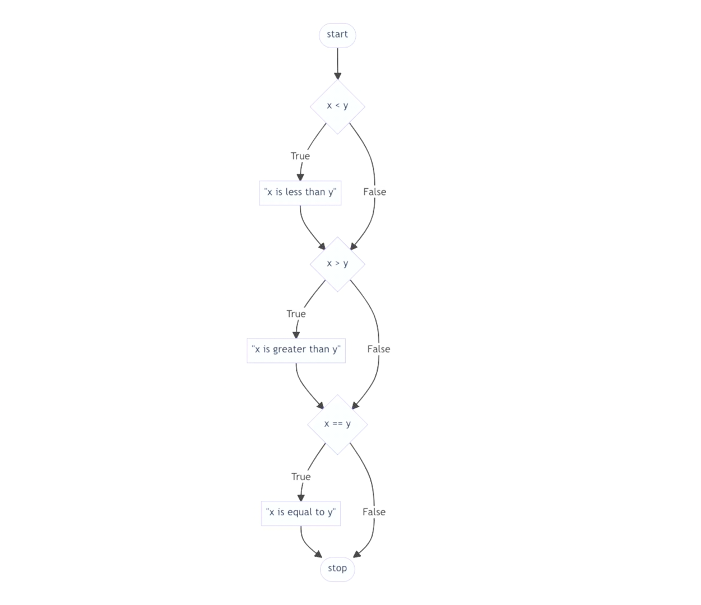
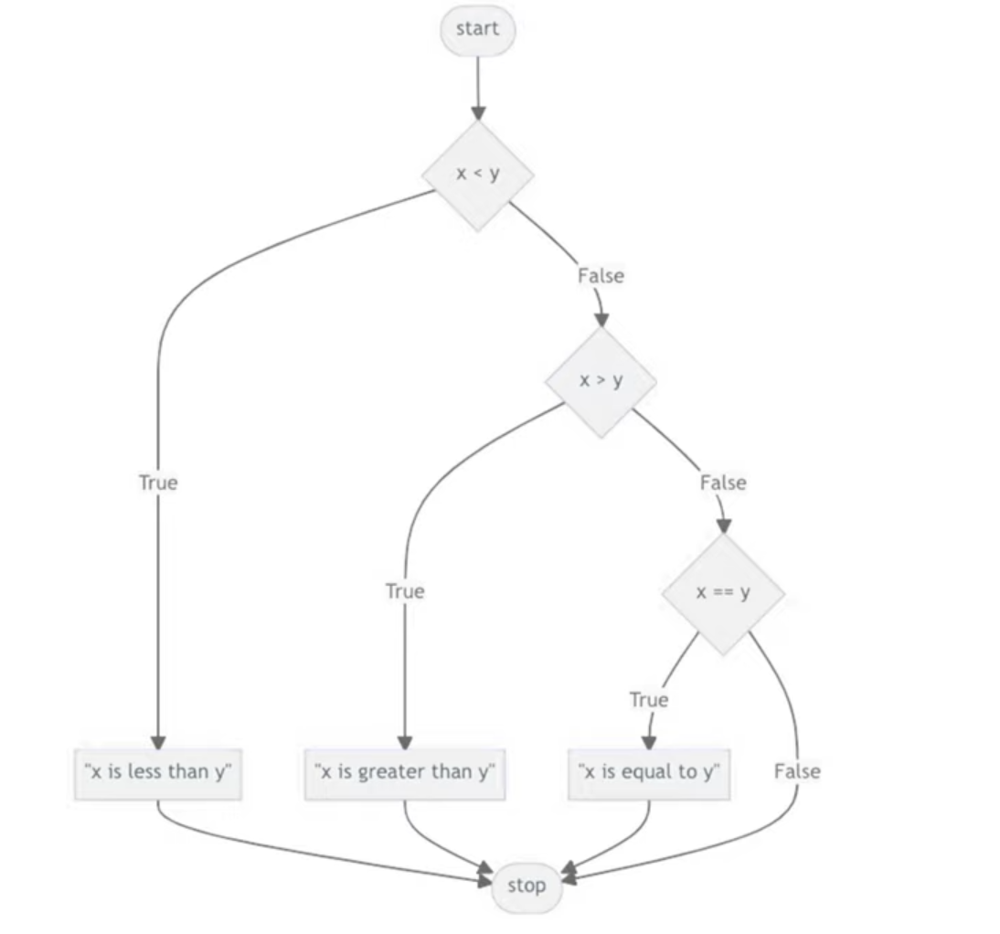
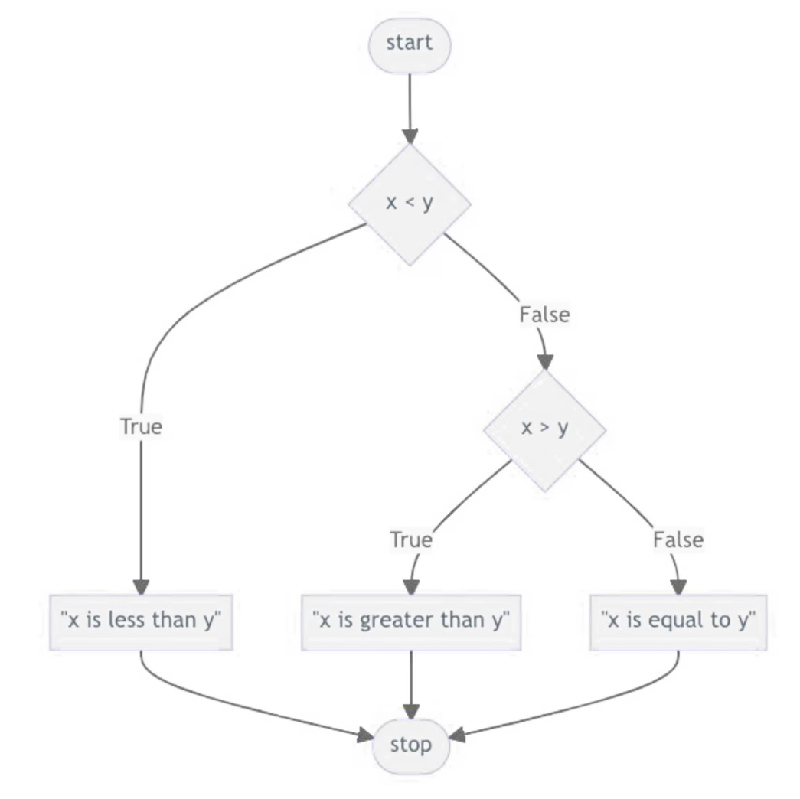
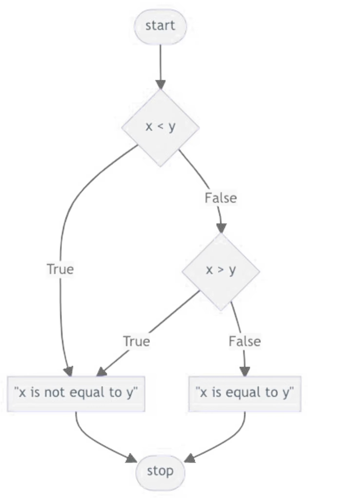
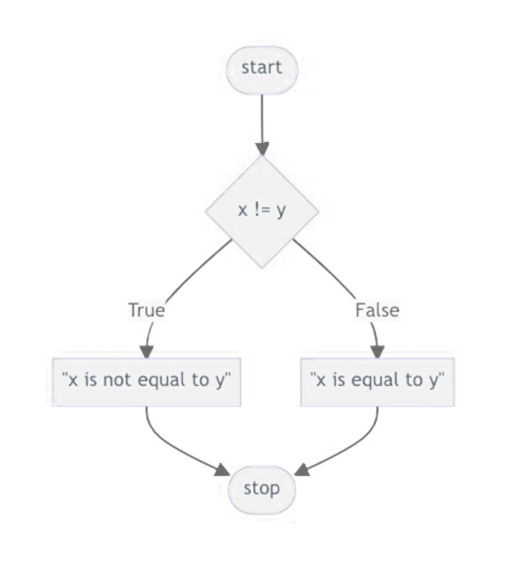

# Week 2 Conditionals

In our code, we want to be able to make decisions based on data. Do different things depending on what inputs we get.
To do this we can use `conditionals`

## Conditionals
* Conditionals allow us to choose which lines of code we want to excute by asking mathematical questions
* Python provide a couple of ways we can ask questions: `>, >=, <, <=, ==, !=`
  * `>` greater than
  * `>=` greater than or equal to
  * `<` less than
  * `<=` less than or equal to
  * `==` equal to
  * `!=` not equal to
* We ask these questions using `if`:
  ```python
  x = int(input("What is x? "))
  y = int(input("What is y? "))

  if (x < y):
    print("x is less than y")
  if (x > y):
    print("x is greater than y")
  if (x == y):
    print("x is equal to y")
  ```
  * `if` tells python to ask a yes or no question
  * `x < y` is the question we are asking
  * `:` again is used to tell python to expect a indentation
  * The lines of code that we want to be excecuted if the answer to the question was yes is then indented by 1 just like how we saw with the functions
  * Note the parenthesis are optional for this if statement, but in the future you made need them to clarify the question you are asking
* Now when we run this program, "x is less than y" will only be printed when x is indeed less than y, "x is greater than y" only when x is greater than y and "x is equal to y" when x is equal to y

* Lets take a look at the flow chart of this program:



* Notice how we ask the next question no matter what the answer to the previous one  was. However, do we need to?
* We know that if x is greater than y, x is not less than y, so we should not ask that question if we already know x is greater than y
* We can avoid asking extra questions using the `elif` keyword
* It works the same as the `if` keyword, however, it will only ask it's question if the answer to the previous `if` or `elif` question was no:
```python
...
if (x < y):
  print("x is less than y")
elif (x > y):
  print("x is greater than y")
elif (x == y):
  print("x is equal to y")
```
* Note: elif must be used in conjunction with an if statement
* This is what the flow chart looks like



* We can actually simplify this a little bit more
* If x is not greater than y nor is it less than y, then it must be equal to y. We don't need to ask the question x == y
```python
...
if (x < y):
  print("x is less than y")
elif (x > y):
  print("x is greater than y")
else:
  print("x is equal to y")

```

* This is what the flow chart looks like



Why do this simplification ?
* We want to make programs run fast. Our modern computers can ask billions of these questions a second. However, imagine you have a billion inputs that you had to ask these questions for. Reducing the number of questions we need to ask will make our programs more efficient and run faster, even if you can't tell with simple programs like this

## Asking multiple questions in one

* We can ask multiple questions at once using `and` and `or`
* For example we can ask:

```python
...
if x < y or x > y:
  print("x is not equal to y")
else:
  print("x is equal to y")
```



* Even simpler we can use:
```python
...
if x != y:
  print("x is not equal to y")
else:
  print("x is equal to y")
```



* We can also use `and` to combine questions:
```python
score = int(input("Score: "))

if score >= 90 and score <= 100:
  print("Grade: A")
if score >= 80 and score < 90:
  print("Grade: B")
if score >= 70 and score < 80:
  print("Grade: C")
if score >= 60 and score < 70:
  print("Grade: D")
if score >= 0 and score < 60:
  print("Grade: F")
```

* These if statements will only excute their lines of code if both of their questions are answered, yes


## Boolean

* if statements can also ask if something is true or not
* We acomplish this using a new data type in python, a `boolean`
* A boolean can only be `True` or `False`
* We can use an if statement to check if a boolean is true like this:
```python
my_bool = True # Notice the capital T (this is how python requires booleans be defined)

if my_bool:
  print("my_bool was true")
```

* What if we want to check if a boolean is false?
```python
my_bool = False

if not my_bool:
  print("my_bool was false")
```

## Inline ifs
* We might define a function that returns something different based on a conditional statement
* For example:
```python
def greater_than_ten(x):
  if x > 10:
    return "Greater"
  else:
    return "Less than or equal"
```

* We can actually simplify this statement like so:
```python
def greater_than_ten(x):
  return "Greater" if x > 10 else "Less than or equal"
```

## Match
* Finally consider the folloing program where we need to check many conditions:
```python
name = input("What's your name? ")

if name == "Harry":
  print("Gryffindor")
elif name = "Hermione":
  print("Gryffindor")
elif name = "Ron":
  print("Gryffindor")
elif name = "Draco":
  print("Slytherin")
else:
  print("Who?")
```
* We may try to simplify this like this:
```python
name = input("What's your name? ")

if name == "Harry" or name = "Hermione" or name = "Ron":
  print("Gryffindor")
elif name = "Draco":
  print("Slytherin")
else:
  print("Who?")
```
* But we can do better using `match`.
* Match checks to see if the variable you want to match matches and of the cases you give it, like this:
```python
name = input("What's your name? ")

match name:
  case "Harry":
    print("Gryffindor")
  case "Hermione":
    print("Gryffindor")
  case "Ron":
    print("Gryffindor")
  case "Draco":
    print("Slytherin")
  case _: # Undercore is the default if nothing else matches
    print("Who?")
```
* If multiple cases do the same thing, we can combine cases using `|` like this:
```python
name = input("What's your name? ")

match name:
  case "Harry" | "Hermione" | "Ron":
    print("Gryffindor")
  case "Draco":
    print("Slytherin")
  case _: # Undercore is the default if nothing else matches
    print("Who?")
```


## Homework:
* Simplify `grade.py` to use < 5 comparisons
  * You can assume the user will only enter in numbers that are between 0 and 100 (inclusive)
  * Make sure your edited program does the exact same thing as the original

* Write me a program that asks me for a number and then tells me if the number I give it is even or not
  * You can assume the user will only enter in numbers that are valid
  * Example usage:

  ```PS
  > python isEven.py
  What is your number? 4
  Your number is even.
  ```