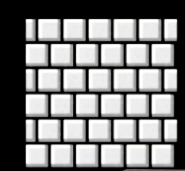

# Week 3 Loops

Loops are a way in a programming language to do something again and again. Why would we want to do this?
* Lets say we want to write a program that "meows" three times like a cat. We can do this like so:

  ```python
  print("meow")
  print("meow")
  print("meow")
  ```
  * This works.
  * Here's how it's flow chart would look like:

  

  * How is this arguably poorly designed?
    * What if we want to "meow" 5 times? 50? times? 500 times? What if instead of "meow" we want to "woof"
    * The solution is not copy-paste

## While Loops

* One solution is to use a `while` loop
  * `while` lets us ask a question, a boolean condition, again and again
  * `while` will keep executing the code inside the while loop again and again as long as the condition we are asking is True every time

* In this example, one way we can solve this problem is by having a variable that counts how many more "meows" we've need to print and each time we print a "meow" we decrease it by one.
* We then "meow" every time we see that this count is not 0
  ```python
  i = 3
  while i != 0:
    print("meow")
  ```
  * What happened?
    * We had an infinite loop because `count != 0` is always true
    * `ctrl+c` is the command to use to stop a python program. It's known as a `keyboard interrupt`
* Let's fix our code:
  ```python
  i = 3
  while i != 0:
    print("meow")
    i = i - 1
  ```
    

* Here's another way to solve this problem:
  ```python
  i = 1
  while i <= 3:
    print("meow")
    i = i + 1
  ```
* Programers actually like to start at 0, you'll see why later. Get used to starting at 0
  ```python
  i = 0
  while i < 3:
    print("meow")
    i += 1 # Means the same thing as i = i + 1. In other languages you'll also see i++ or i--. However, python does not support these
  ```


## Python Lists

Python `lists` are another another datatype that python supports. `lists` are simply a list of items, they could me `int`, `str`, `bool`, and more, or any combination of them.

* We define a list using square brackets `[]` as so:
```python
shopping_list = ['Apples', 'Salt', 'Pepper', 'Tomato Soup', 'Bread']
```

## For loops

A `for` loop is another type of loop that lets use `iterate` or "go through" items in a list
  ```python
  for i in [0, 1, 2]:
    print("meow")
  ```
  * In this loop, the variable `i` will first take on the value of `0`, then `1`, then finally `2`. This is what a for loop goes. It lets us go through each element in a list
  * This code isn't perfect though. Why?
    * Again, what if we want to "meow" 500 times?


## range()

* We don't want to define the list by hand every time we want to iterate through a list.
* We can use a function to do that for us
* Python's `range()` function will create a list for us.

* If we only supply 1 argument it will give us all the values from 0, 1, up to but not including our argument:
  ```python
  range(3) # [0, 1, 2]
  ```
* If we supply 2 arguments it will give us all the values starting at the first argument, counting up by 1, up to but not including our second argument:"
  ```python
  range(3, 6) # [3, 4, 5]
  ```
* If we supply 3 arguments it will give us all the values starting at the first argument, counting (or down) up by out second argument, up to but not including our third argument:
  ```python
  range(3, 10, 2) # [3, 5, 7, 9]
  range(10, 3, -2) # [10, 8, 6, 4]
  ```

* In a for loop, we can use `range()` like so:
  ```python
  for i in range(3):
    print("meow")
  ```
  * Note, notice that the variable `i` is never actually used.
  * However, to use a python `for` loop, we are required to define a variable.
  * By convention then, these variables that we are required to define but don't actually need to use, we define as being and underscore `_`:
    ```python
    for _ in range(3):
      print("meow")
    ```
  
## String multiplication?

Python lets us concatinate strings over and over again using the `*` operator on `str`.
```python
"meow" * 3 # the same as "meow" + "meow" + "meow"
```
* So another way we can solve this meowing problem is like so:
  ```python
  print("meow\n" * 3, end="")
  ```
  * This is indeed shorter but arguably less readable. Only do this if you are sure you and everyone else who is going to read your code is going to understand what is happening

## cat.py

Let's say we want this cat program to as the user how many times we should meow.
* We can use `input()`!
* However, what if the user enters in a negative number?
* We want to check if the number the user enters is less than 0 and ask the user to try agian if it is not

```python
n = int(input("What's n? "))
if n < 0:
  n = int(input("What's n? "))
  if n < 0:
    n = int(input("What's n? "))
    ...
```
* This isn't great huh...

## Break and Continue

We can use a loop along with the `continue` and `break` keywords to help us
* `continue` tells python to skip everything else inside this loop and go back to the top of the loop and go again
* `break` tells python to leave the current loop and move onto whatever is after the loop
```python
while True: # Creating an infinite loop?
  n = int(input("What's n?"))
  if n < 0:
    continue # if n is negative, continue looping and asking the user to enter n
  else:
    break # if n is not negative, we want to leave the infinite loop and move on

for _ in range(n): # n is n not negative here
  print("meow")
```
* We actually aren't required to use `continue` in this program. But keep it in mind as it is useful in other cases.
```python
while True:
  n = int(input("What's n? "))
  if n >= 0:
    break

for _ in range(n):
  print("meow")
```

## get_positive_number()

It's likely that as programmers we want to get a positive number from a user many times. Let's make a function
```python
def get_positive_number():
  while True:
    n = int(input("Enter a positive number: "))
    if n > 0:
      return n
    print("Try again")
```
* Notice that `return` here acts a little bit similarly to `break`. It also allows us to leave a loop by returning from the function

Let's update our `cat.py` program to use this function
```python 
def main():
  num_meows = get_positive_number()
  for _ in range(num_meows)
    print("meow")

def get_positive_number():
  while True:
    n = int(input("Enter a positive number: "))
    if n > 0:
      return n
    print("Try again")
```

## Back to lists

What if we want to get a specific item from a list?
* We again use the square brackets `[]`:
```python
students = ["Hermione", "Harry", "Ron"]

print(students[0]) # Notice. Lists start at index 0!. This is why starting at 0 is useful for computer programmers
print(students[1])
print(students[2])
```
* We can also use a loop to simplify this code. `for` loops don't just work on lists on numbers, it also works on lists of `str`
```python
students = ["Hermione", "Harry", "Ron"]

for student in students:
  print(student)
```
* Perhaps you need to use the index of the student in your code. We can iterate through this list differently using `len()`.
  * `len()` gives us the length of a list
  ```python
  students = ["Hermione", "Harry", "Ron"]
  len(students) # this is 3
  for i in range(len(students)):
    print(students[i])
  ```

## Dictionaries

Python `dict` is another type of data. 
* `dict` is a dictionary of `key`, `value` pairs. Something (a key) is matched with something else (a value) just like how in a dictionary a word is matched with a definition


Let's say we want to keep track of each student's house. We could do this using lists that line up:
```python
students = ["Hermione", "Harry", "Ron", "Draco"]
houses = ["Gryffindor", "Gryffindor", "Gryffindor", "Slytherin"] # Hermione (index 0) is in Gryffindor (index 0)
```
* This works but is hard to maintain. Also what if we want to store more information like what each student's patronus is?

Let's use a `dict`.
* We define a `dict` like so:
  ```python
  students = {
    "Hermione": "Gryffindor",
    "Harry": "Gryffindor",
    "Ron": "Gryffindor",
    "Draco": "Slytherin"
  }
  ```
* We access the values in a dictionary again using the square brackets `[]`
  ```python
  print(students["Hermione"])
  print(students["Harry"])
  print(students["Ron"])
  print(students["Draco"])
  ```
* `for` loops also works for `dict`. However, it iterates through the keys:
  ```python
  for student in students:
    print(student) # Hermione then Harry then Ron then Draco
  ```
  * To get the value as well:
  ```python
  for student in students:
    print(student, students[student], sep=', ')
  ```

What if we have more data about each student?


## Lists of dictionaries

Python lists can be a list of just about anything (including lists and dicts)

```python
students = [
  { "name": "Hermione", "house": "Gryffindor", "patronus": "Otter" },
  { "name": "Harry", "house": "Gryffindor", "patronus": "Stag" },
  { "name": "Ron", "house": "Gryffindor", "patronus": "Jack Russell Terrier" },
  { "name": "Draco", "house": "Gryffindor", "patronus": None },
]

for student in students: # student is a dictionary
  print(student["name"], student["house"], student["patronus"], sep=", ") # For each student in our list of students, print out their name, house, and patronus
```
* Notice the `None`. This tells python, literally, this value does not exist. We can use it for variables and, in this case, dict values and more

## mario.py

* Let's say we want to make super mario. To start off, we want to display the blocks mario jumps on.
* We aren't going to worry too much about how this looks right now, we're just going to print blocks as hashes (`#`)


* We also want to display the bricks mario will hit. We'll display them as question marks (`? `)


* Finally we also want to display a square of bricks with more depth to them, let's just say they are 3x3



* Let's make each of these functions: `print_col()`, `print_row()`, and `print_square()`

* Here are a couple ways to define `print_col()`
```python
def print_col(n):
  for _ in range(n):
    print('#')
```
```python
def print_col(n):
  print('#\n' * n, end="")
```

* Here are a couple ways to define `print_row()`
```python
def print_row(n):
  for _ in range(n):
    print('?', end='')
  print()
```
```python
def print_row(n):
  print('?' * n)
```

* For `print_square()` one way we can do this is to use a `nested` loop (loops inside loops)
```python
def print_square(n):
  for row in range(n): # For each row
    for col in range(n): # For each col
      print("#", end="") # Print a block
    print() # at the end of each row, make a new line
```
```python
def print_square(n):
  for row in range(n): # We can also use some abstraction and use a print_row() function
    print_row(n)
```

We can also use the variable defined by the outer loop as part of our inner loop. For example:
```python
for row in range(5):
  for col in range(row + 1):
    print("#", end="")
  print()
```
This outputs:
```PS
#
##
###
####
#####
```

## Homework

* Write a program that takes a user input number
  * If the user's number is less than 3, tell them to try again and prompt them to input another number
  * One the user's number is greater than or equal to 3, print out a upside down triangle with side lengths equal to the user's input
  * For example:
  ```PS
  > python triangle.py
  Enter a number greater than or equal to 3: -1
  Try again.
  Enter a number greater than or equal to 3: 4
  ####
  ###
  ##
  #
  ```

* Challenge:
  * Try making different triangles
  * Here are some ideas, try to come up with more:
  ```PS
  ####
   ###
    ##
     #


  #
  ###
  #####
  ###
  #


      #
    ###
  #####
    ###
      #

    #
   ###
  #####
  ```